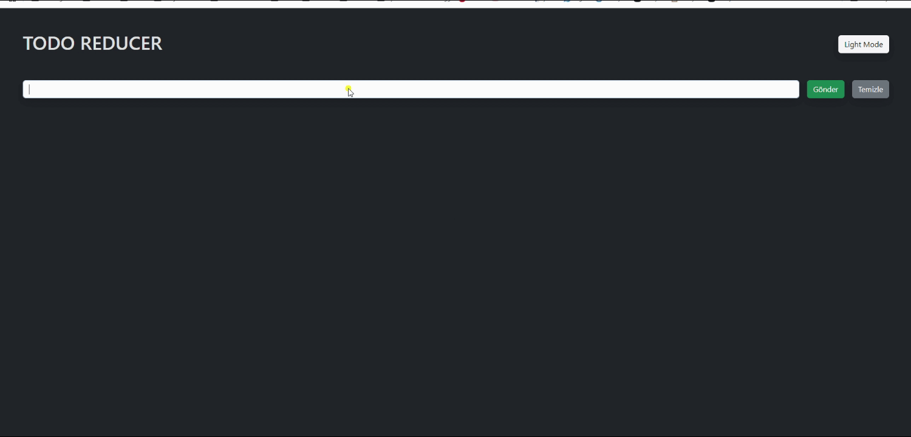

# Todo Reducer App

## Açıklamaları verilen Hooklar kullanılarak geliştirilmiştir

# Memorization

- Daha önce hesaplanmış bir veriyi ya da daha önce render edilmiş bir bileşeni tekrardan gerektiğinde yeniden hesaplama yapmak yerine ilk hesaplamadaki verileri saklarız.Saklanan verileri kullanırız.Bu sayade gereksiz hesaplamaların önüne geçeriz.Performansı arttırırız.Sayfa yüklenme sürelerini kısaltırız.

## useMemo()

- Daha önce yapılan hesaplamaların sonuçlarını hafızada tutarız.

## useCallback()

- Daha önce oluşturulan bir fonksiyonu hafızada tutar.

## React.memo()

- Daha önce ekrana basılan bir bileşeni hafızda tutar.

# useReducer

- - Dispatch(Sevketmek):

- Actionların bileşen içerisinden reducera aktarır.

- - Action(Eylem / Emir):

- State'in nasıl değişeceğini ifade ettiğimiz metinlerdir.

# Ekran görüntüsü

# 
# Memorization-Todo-Reducer
